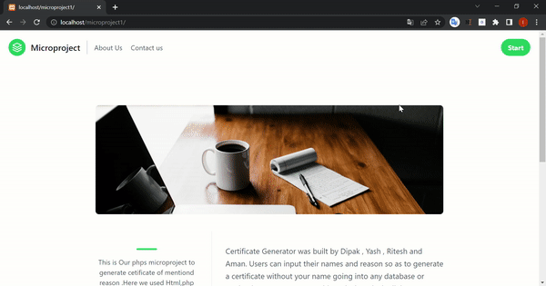

# Certificate Generator

 [](https://awesome.re)  [](https://shields.io) [](https://shields.io)
 [](https://shields.io)
 [](https://shields.io)


This is a **MiniProject** to generate cetificate of mentiond reason . Users can input their names and reason so as to generate a certificate without your name going into any database or storing in any server


## Run Locally

Go to the directory

```bash
  cd C:\xampp\htdocs
```
Clone the project to new directory

```bash
  git clone https://github.com/dipakgdhumma/MiniProjectOnCertificateGenerator.git
```

Open XAMPP or other local server

```bash
  start apache server
```

On browser open this file using

```bash
  http://localhost/foldername/
```
## Demo



## 🚀Features
- Simple and easy to use
- Live previews
- Responsive
- Interactive

## 🛠 Skills
- PHP
- TailWind CSS ( CSS Framework )
- HTML
- CSS
- JavaScript ( Little Bit )

## Acknowledgements
Use this space to list resources you find helpful and would like to give credit to. I've included a few of my favorites to kick things off!
 - [Tailwind CSS](https://awesomeopensource.com/project/elangosundar/awesome-README-templates)
 - [README Editor](https://readme.so/editor)
 - [Badges for README](https://shields.io/)
 - [Image resources](https://unsplash.com/)


